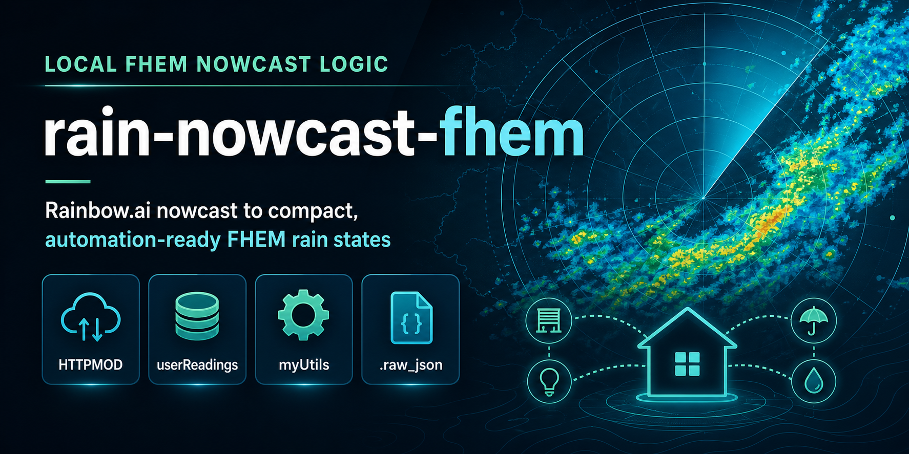
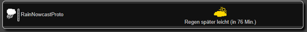

# rain-nowcast-fhem

Lokale Regen-Nowcast-Logik für FHEM. Das Projekt holt Rainbow.ai-Daten per `HTTPMOD`, wertet sie in `myUtils` aus und stellt daraus kompakte, automationsfreundliche Readings für FHEM-Installationen bereit.

## Überblick

Statt Wetter-Apps manuell zu prüfen, bekommst du direkt in FHEM nutzbare Zustandswerte wie:

- `rain_now`
- `rain_in_minutes`
- `next_rain_rate`
- `next_rain_type`
- `next_rain_begin`
- `rain_state`
- `summary_intensity`

Darauf aufbauend lassen sich alltagstaugliche Automationen bauen, zum Beispiel:

- Warnungen für geöffnete Dachfenster
- Warnungen für Türen oder Balkontüren
- Markisen- oder Beschattungslogik
- Gieß-Sperren bei bevorstehendem Regen

## Architektur

Die Lösung bleibt bewusst schlank:

1. `HTTPMOD` holt die Nowcast-Daten für einen festen Standort.
2. Der aktuelle Payload wird in `.raw_json` gespeichert.
3. `99_myRainNowcastUtils.pm` wertet `forecast[]` aus.
4. `userReadings` schreiben kompakte Ziel-Readings auf dasselbe Device zurück.
5. `notify` kann daraus Sprachwarnungen oder weitere Aktionen ableiten.

Die Warnlogik erkennt automatisch:

- Dachfenster über `attr <device> IsRoofWindow 1`
- Türen über Device-Namen mit `_Kontakt_Tuer`

Für Ansagetexte wird bevorzugt das FHEM-`alias` verwendet, sonst der Device-Name.

## So sieht das in FHEMWEB aus

Das Device bleibt kompakt, zeigt aber trotzdem direkt den aktuellen Regenzustand und die nächste relevante Änderung in lesbarer Form an.

## Schnellstart

Du brauchst:

- einen Rainbow.ai API-Key
- ein FHEM-Device auf Basis von `HTTPMOD`
- die Hilfsfunktionen in `99_myRainNowcastUtils.pm`
- `userReadings` auf demselben Device

Der technische Einstiegspunkt ist:

- [HTTPMOD + myUtils Einrichtung](docs/rain-nowcast-fhem-httpmod-myutils-prototype.md)

Dort findest du:

- die aktuelle Beispielkonfiguration für `RainNowcastProto`
- die Reading-Ableitung über `.raw_json`
- Debug-Aufrufe für die FHEM-Konsole
- `notify`-Beispiele für `rain_update` und `contact_open`

## Beispiel-Nutzen im Alltag

- `rain_update`: Regen ist in den nächsten 30 Minuten angesagt und mindestens ein Dachfenster steht offen.
- `contact_open`: Ein Dachfenster oder eine Tür wird geöffnet, während Regen bereits für die nächsten 30 Minuten ansteht.

Die Funktion `myRainNowcastWarnIfNeeded(...)` deckt beide Fälle ab und kann direkt aus `notify` aufgerufen werden.

## Dokumentation

- [Projektidee](docs/rain-nowcast-fhem-idea.md)
- [HTTPMOD + myUtils Einrichtung](docs/rain-nowcast-fhem-httpmod-myutils-prototype.md)
- [FSD](docs/rain-nowcast-fhem-fsd.md)

## Grenzen der aktuellen Version

- ein Standort pro Device
- kein eigenes FHEM-Modul
- keine Historie
- kein Fokus auf andere Smart-Home-Systeme oder internationale Dokumentation

## Mitwirken

Kleine, saubere Verbesserungen sind willkommen. Wenn du Verhalten, Readings oder Doku änderst, halte bitte die passenden Dateien aktuell.

## Lizenz

Dieses Projekt steht unter der [MIT-Lizenz](LICENSE).
